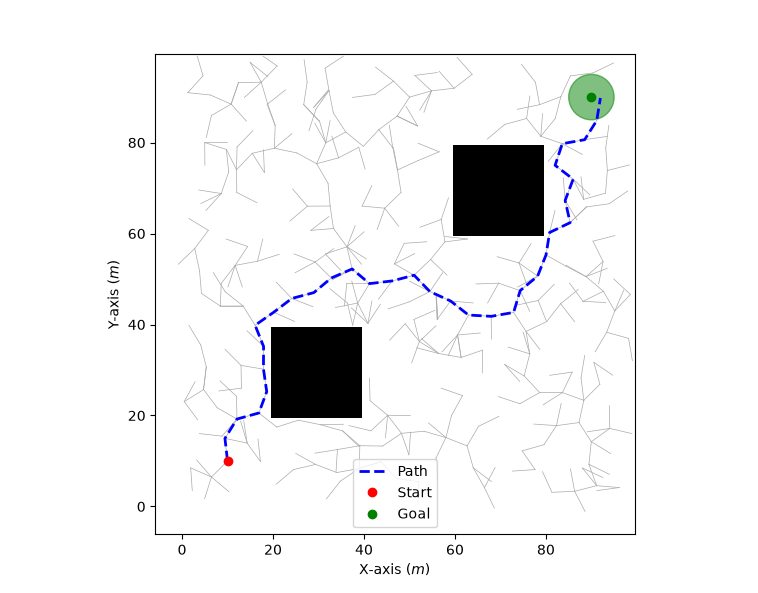

# Path Planning

Hands-on exploration of sampling-based motion planning algorithms in Python.



## Algorithms

| Algorithm | Status |
|-----------|--------|
| RRT (Rapidly-exploring Random Tree) | Done |
| RRT March | Planned |
| RRT* | Planned |
| PRM (Probabilistic Road Map) | Planned |

## Setup

```bash
uv sync
uv run main.py
```

## Dependencies

- `numpy` — configuration space and geometry
- `matplotlib` — visualization
